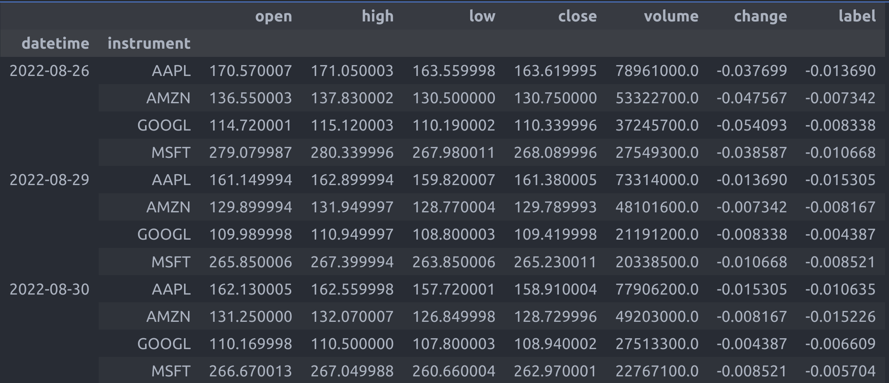

# InvariantStock: Learning Invariant Features for Mastering the Shifting Market [paper](https://openreview.net/pdf?id=dtNEvUOZmA)
Accurately predicting stock returns is crucial for effective portfolio management. However, existing methods often overlook a fundamental issue in the market, namely, distribution shifts, making them less practical for predicting future markets or newly listed stocks. This study introduces a novel approach to address this challenge by focusing on the acquisition of invariant features across various environments, thereby enhancing robustness against distribution shifts. Specifically, we present InvariantStock, a designed learning framework comprising two key modules: an environment-aware prediction module and an environment-agnostic module. Through the designed learning of these two modules, the proposed method can learn invariant features across different environments in a straightforward manner, significantly improving its ability to handle distribution shifts in diverse market settings. Our results demonstrate that the proposed InvariantStock not only delivers robust and accurate predictions but also outperforms existing baseline methods in both prediction tasks and backtesting within the dynamically changing markets of China and the United States.

## Model Structure

## Environment and Dependencies
```
Python==3.9
cuda==11.8
pytorch==2.1.0
pandas
numpy
```

## DataSet
### China
The daily fundamentals and price features on China stock market can be derived from [Tushare](https://github.com/waditu/tushare)

### US
US data can be derived from yahoo finance using [yfinance](https://github.com/ranaroussi/yfinance)

### Data Samples

## Experiment
### Normalization and data split
```sh
python make_dataset.py
```
### trainig the model
```sh
python main.py 
```
## Citation


