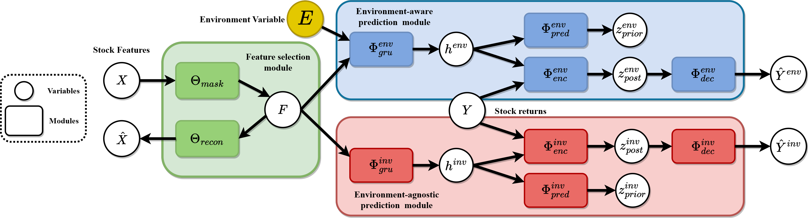

# InvariantStock: Learning Invariant Features for Mastering the Shifting Market [paper](https://openreview.net/pdf?id=dtNEvUOZmA)
Accurately predicting stock returns is crucial for effective portfolio management. However, existing methods often overlook a fundamental issue in the market, namely, distribution shifts, making them less practical for predicting future markets or newly listed stocks. This study introduces a novel approach to address this challenge by focusing on the acquisition of invariant features across various environments, thereby enhancing robustness against distribution shifts. Specifically, we present InvariantStock, a designed learning framework comprising two key modules: an environment-aware prediction module and an environment-agnostic module. Through the designed learning of these two modules, the proposed method can learn invariant features across different environments in a straightforward manner, significantly improving its ability to handle distribution shifts in diverse market settings. Our results demonstrate that the proposed InvariantStock not only delivers robust and accurate predictions but also outperforms existing baseline methods in both prediction tasks and backtesting within the dynamically changing markets of China and the United States.

## Model Structure


## Pseudocode of Training Process

**Input:** stock features X, Environment E and stocks return Y  
**Parameter:** Feature selection module Θ, Environment-aware prediction module Φ_env, Environment-agnostic prediction module Φ_inv  
**Output:** the prediction of stocks returns Ŷ

1. Let e = 0.
2. **while** e < total epochs **do**
   - F = Φ(X)
   - Ŷ_env, μ_env_post, σ_env_post, μ_env_prior, σ_env_prior = Φ_env(F, E, Y).
   - Ŷ_inv, μ_inv_post, σ_inv_post, μ_inv_prior, σ_inv_prior = Φ_inv(F, Y).
   - **if** e%3 == 0 **then**
     - Calculate L_θ according to feature selection objective.
     - Update Θ.
   - **elif** e%3 == 1 **then**
     - Calculate L_inv according to environment-agnostic module objective.
     - Update Φ_inv.
   - **elif** e%3 == 2 **then**
     - Calculate L_env according to environment-aware module objective.
     - Update Φ_env.
3. **end while**
4. **return** Θ, Φ_inv

## Environment and Dependencies
```
Python==3.9
cuda==11.8
pytorch==2.1.0
pandas
numpy
```

## DataSet
### China
The daily fundamentals and price features on China stock market can be derived from [Tushare](https://github.com/waditu/tushare)

### US
US data can be derived from yahoo finance using [yfinance](https://github.com/ranaroussi/yfinance)

### Data Samples
Here's some examples from US dataset:
|    | datetime            | instrument   |   Open |   High |    Low |   Close |   Volume |      change |       label |
|---:|:--------------------|:-------------|-------:|-------:|-------:|--------:|---------:|------------:|------------:|
|  0 | 2024-01-09| AAPL         | 183.92 | 185.15 | 182.73 |  185.14 | 42841800 | -0.00226341 |  0.0056714  |
|  1 | 2024-01-09| AMZN         | 148.33 | 151.71 | 148.21 |  151.37 | 43812600 |  0.0152246  |  0.0155909  |
|  2 | 2024-01-09| GOOGL        | 138.5  | 141.49 | 138.15 |  140.95 | 24759600 |  0.0151974  |  0.00943598 |
|  3 | 2024-01-09| MSFT         | 372.01 | 375.99 | 371.19 |  375.79 | 20830000 |  0.00293578 |  0.0185742  |
|  4 | 2024-01-10| AAPL         | 184.35 | 186.4  | 183.92 |  186.19 | 46792900 |  0.0056714  | -0.00322255 |
|  5 | 2024-01-10| AMZN         | 152.06 | 154.42 | 151.88 |  153.73 | 44421800 |  0.0155909  |  0.0094321  |
|  6 | 2024-01-10| GOOGL        | 141    | 143    | 140.91 |  142.28 | 21320200 |  0.00943598 | -0.00140566 |
|  7 | 2024-01-10| MSFT         | 376.37 | 384.17 | 376.32 |  382.77 | 25514200 |  0.0185742  |  0.00485936 |
|  8 | 2024-01-11| AAPL         | 186.54 | 187.05 | 183.62 |  185.59 | 49128400 | -0.00322255 |  0.00177812 |
|  9 | 2024-01-11| AMZN         | 155.04 | 157.17 | 153.12 |  155.18 | 49072700 |  0.0094321  | -0.0036087  |
| 10 | 2024-01-11| GOOGL        | 143.49 | 145.22 | 140.64 |  142.08 | 24008700 | -0.00140566 |  0.00401177 |
| 11 | 2024-01-11| MSFT         | 386    | 390.68 | 380.38 |  384.63 | 27850800 |  0.00485936 |  0.00998361 |
## Experiment
### Data Preprocessing
```sh
python make_dataset.py
```
### Training the model
```sh
python main.py 
```
## Portfolio Strategy
Based on the predictions generated, we employ the 
$TopK$ strategy for portfolio construction, wherein each stock within the portfolio is assigned equal weight. The 
$TopK$ strategy involves selecting the top 
$k$ stocks with the highest predicted returns for a long position, while simultaneously shorting the $k$ stocks with the lowest predicted returns. It's important to note that in the China stock market, due to specific policies, only long positions are executed. In China stock market, there are regulatory mechanisms such as 'limit-up' or 'limit-down' rules. When a stock hits its limit-up, it becomes hard for further buying orders to be filled.  similarly, hitting the limit-down prevents selling further orders. Conversely, in the US market, both long and short positions are feasible. Additionally, a commission fee is unilaterally charged at a rate of 0.0015 in both markets.
## Citation
```
@article{
cao2024invariantstock,
title={InvariantStock: Learning Invariant Features for Mastering the Shifting Market},
author={Haiyao Cao and Jinan Zou and Yuhang Liu and Zhen Zhang and Ehsan Abbasnejad and Anton van den Hengel and Javen Qinfeng Shi},
journal={Transactions on Machine Learning Research},
issn={2835-8856},
year={2024},
url={https://openreview.net/forum?id=dtNEvUOZmA},
note={}
```
}
